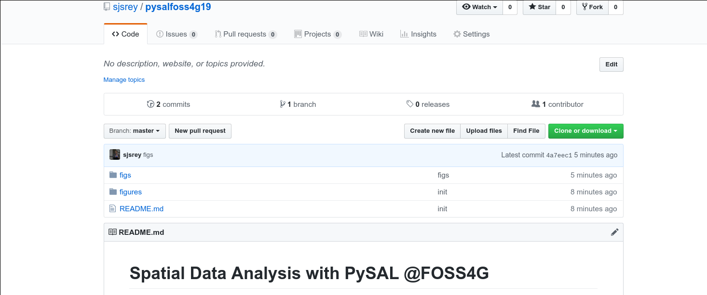
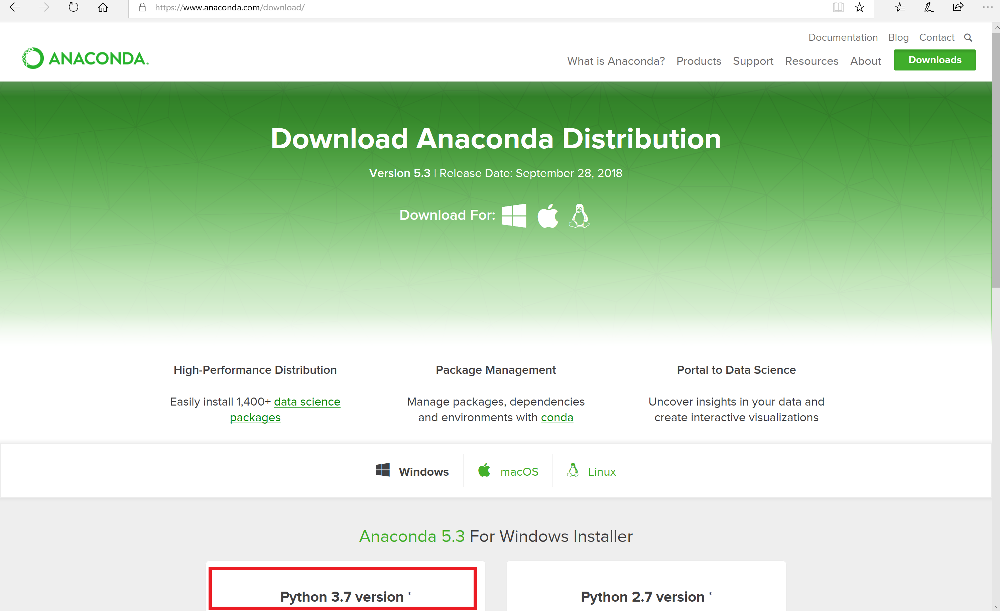
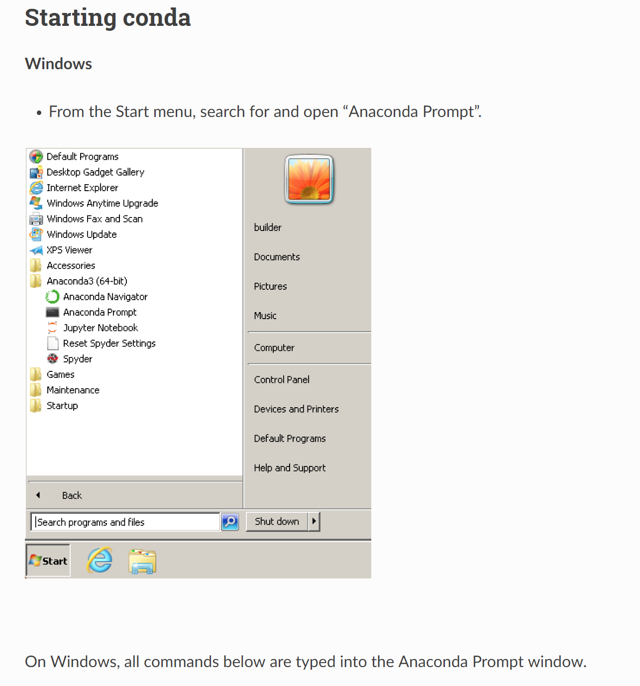
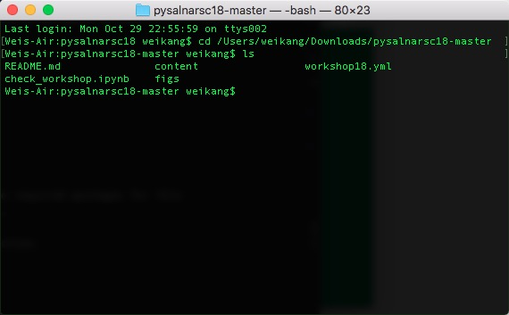

# {{ cookiecutter.project_name }}

[](https://mybinder.org/v2/gh/{{ cookiecutter.github_username }}/{{ cookiecutter.repo_name }}/master?urlpath=lab)

{{ cookiecutter.description }}

### Instructors

* {{ cookiecutter.author_name  }} - {{ cookiecutter.author_affiliation }}

---

## Schedule

### Part 1

1. First Section
   + subsection
   + subsection


2. Second section

   + subsection
   + subsection

### Break

### Part 2

3. Third Section

   + subsection
   + subection

4. Fourth Section

   + subsection
   + subection

## Obtaining Workshop Materials

**To get started immediately without installing or downloading anything, click the *"Launch Binder"* button at the top of this page**

---
If you are familiar with GitHub, you should clone or fork this GitHub repository to a specific directory. Cloning can be done by:

``` bash
git clone https://github.com/{{ cookiecutter.github_username }}/{{ cookiecutter.repo_name }}.git
```

If you are not using git, you can grab the workshop materials as a zip file by pointing your browser to (https://github.com/{{ cookiecutter.github_username }}/{{ cookiecutter.repo_name }}.git) and clicking on the green _Clone or download_ button in the upper right.



Extract the downloaded zip file to a working directory.

## Installation

We will be using a number of Python packages for geospatial analysis.

An easy way to install all of these packages is to use a Python distribution such as [Anaconda](https://www.anaconda.com/download/#macos). In this workshop we will use anaconda to build an [environment](https://conda.io/docs/user-guide/tasks/manage-environments.html) for **Python 3.6**. It does not matter which version of anaconda is downloaded. We recommend installing Anaconda 3.7.



On windows, all our work will begin from an anaconda prompt, which you can start as follows:



Start a terminal and navigate to the directory of the downloaded/ cloned materials. For example, if the materials now live in the directory `/Users/{{ cookiecutter.github_username }}/Downloads/{{ cookiecutter.repo_name }}` , you need to navigate to that directory from the terminal (using command `cd` ):



Once we have done that, run:

``` bash
conda-env create -f environment.yml
```

This will build a conda python {{ cookiecutter.python_version }}environment that sandboxes the installation of the required packages for this workshop so we don't break anything in your computer's system Python (if it has one).

This may take 10-15 minutes to complete depending on the speed of your network connection.

Once this completes, you can activate the workshop environment with:

``` bash
conda activate {{ cookiecutter.repo_name }}
```

You're now all setup for the tutorial!

## Troubleshooting

If you encounter the following error when starting jupyterlab:

``` bash
FileNotFoundError: [WinError 2] The system cannot find the file specified
```

A solution is to issue the following command in the anaconda prompt:

``` bash
 python -m ipykernel install --user
```
